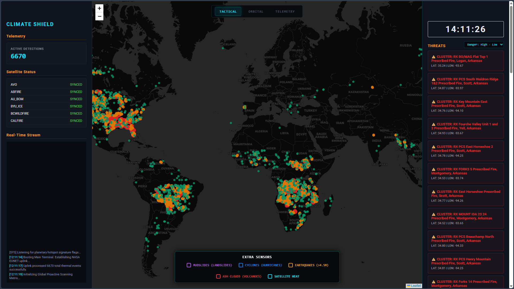

# The README file is divided in two sections, the first one is a summary of the project, the second section is a more detailed blog written (not complete).

# CLIMATE SHIELD

I created Climate Shield because I had in mind the idea of creating a dashboard that could show how the world is going, what is happening, and what might happen.
I also learned a lot of new things about the climate in the process making this.

[Test it here](https://climate-shield.netlify.app/) (I use the free tier of render for the backend so you may need to reload multiple times if the server is asleep)

-------------

-------------

## First I want to make something clear, I did use AI to help me with it, here's how and what for:

1. To translate standard NASA/USGS JSON structures into `Float32Array` WebGL inputs for the globe (orbital).
2. To formulate calculations (I am just a programmer, not a scientist. I am unknown of the formules and calculations for predictions I show in my web).
3. To debug errors/bugs and optimize no-lag browser performance for all the data's being calculated.
4. Not always but I did use AI for styling elements

----------

## I split the web up in 3 sections/pages
1. **TACTICAL (2D dashboard):** This is the primary page where you should go to if you to have all data visualized but also want more information, a bit like a all-in-one dashboard.
2. **ORBITAL (3D WebGL globe):** This is where you go if you want just a visualisation, you see a globe of the earth and pilars having the color of the category of a fire and the height depending on the density of a fire.
3. **TELEMETRY ((raw) data):** This is where to go when you are some kind of scientist who just wants (raw) data, Every time I add some new data API's or similar I will try to also categorise the data in here (for nerds)

----------

## How to use:
I primarly made this web with the idea of it being for some weather or NASA scientists, but I tried my best also to make it understandable for non-scientists, (like me). 

### Fire risk from a point
* **How to use:** Click anywhere on an empty place in the map (only in TACTICAL). 
* **What it does:** The system draws an 80km radius around the point and asks Open-Meteo and OpenWeatherMap. It's current Temperature, Wind Speed, Relative Humidity, and Soil Moisture. 
* **The Science:** By analyzing soil dryness with heat and wind, the AI calculates a percentage of fire-risk-probability within 48 hours. (keeps updating live)

### Live fire
* **How to use:** Click on any active fire marker. Click the "Calculate Resource Requirements" button.
* **What it does:** It generates a real-time report.
* **The Science:** 
  * *Uphill Alignment:* Fire spreads much faster uphill. The backend finds the exact terrain elevation and slope angle to calculate a spread multiplier.
  * *Fire density:* The system also calculates the thermal output and the volume of water (in Liters) required to put the fire out based on the fire's density.

### Extra sensors (Bottom Dock)
* **Mudslides (Landslides):** When fires burn a mountain, roots die and soil becomes hydrophobic (you can compare it like glass). This radar finds active fires located on steep slopes (>600m) and shows them as Mudslide Risk Zones for when the next rainstorm hits.
* **Cyclones (Hurricanes):** Hurricanes are giant, fueled by ocean water warmer than 26.5°C. This sensor tracks Deep-Ocean Sea Surface Temperature (SST) to visualize where future storms will spawn.
* **Earthquakes:** This sensor isolates and maps significant tectonic fractures (Magnitude > 4.5).
* **Ash Clouds (Volcanoes):** NASA EONET data tracks volcano ash clouds, which make severe threats to aviation and climate cooling.
* **Satellite Heat (Raw Radiometry):** Shows fires that aren't that big, telling you the intensity (FRP) and heat (in Kelvin). This is only avaible where they have sensors for it, not everywhere.

----------

## Stats of the code
* **Frontend (hosted on Netlify):** Vanilla JavaScript, HTML5 Canvas, Leaflet.js, Globe.gl (Three.js/WebGL), Chart.js
* **Backend (Hosted on Render):** FastAPI (Python)
* **API's** 
  * *NASA EONET* (Volcanoes, Fires, ...)
  * *NASA FIRMS MODAPS* (Raw Radiometry/FRP)
  * *USGS*
  * *OpenWeatherMap* (Weather data)
  * *Open-Meteo* (Soil Hydrology, Air Quality, Elevation)

----------

## In the future:
* Currently I am working on finding more usefull data and being able to display it without overloading the whole web or having a messy dashboard full of unnecesary things.

----------

## Run it yourself
1. Clone the repository: `git clone https://github.com/HackerDpro/climate-shield`
2. Set up your backend environment variables in an `.env` file:
   ```env
   OWM_KEY=your_open_weather_map_key
   FIRMS_KEY=your_nasa_firms_map_key
3. Start with the backend with:
   *uvicorn main:app --reload* (or look in the file terminal.txt)


## Little unfiltered blog (may contain some errors and be boring to read):

**Day 1:** 
I made the basics of the software. I first started by brainstorming ideas of ways I could help NASA. Due to the summer coming and the high fire risk I decided to make a fire prediction page (or just fire stats). In the first day I brainstormed all the ideas of API's I was going to need, data I would like to show, tools that may be useful, and making the structure of the page. Later I got to work. I used Leaflet to add a map and added some cool black map to our site. After the map, I added the fire pinpoints. I needed to know where the fires were at, therefore I used the NASA FIRMS MAP API, that showed the current fires. For the fire prediction I got into the idea of predicting the fire risk using the (current) weather data, in that way I could use the wind speed and direction to calculate vectors of where the fire might spread to. For that I used the openweathermap API. In conclusion, my maps are able to show the points of current fires as well as the vectors covering fire risk areas,just how I wanted.

**Day 2:** 
In day 2 lots of things happened. I started improving everything, here is how: I first started by finding a method to increase the number of fire events shown at once. I corrected the previous limit of calls of 500 fires that I was using for testing other aspects of my code, otherwise my browser would have crashed repeatedly as I would try to move the map or zoom. I found a method to display all 6K+ fires by showing them on a HTML5 canvas, in that way each time that a user would reload the page it would almost instantly pop up without any problems or lags. But that wasn't all, the second reason I still couldn't show all fires at first was the weather. My openweathermap API has a limit that would have been exceeded when loading 6k+ fires. On top of it, it would have considered the calls as spamming. The way I fixed that was by making the vectors not show anymore on the map. From now on you can click on the fires and they will then show the weather info and show the vectors, but only when the user asks for it. That way we now could display all 6k+ fires without any problems.

So next I started working on the page cause this wasn't meant to just be a map, it was a dashboard. I started to make a structure for info shown, I found the best way was to make two vertical panels on the sides of the screen (left, right). Now we needed to add data to those panels, I've tried different things but in the end I finnished with just a simple structure at the left-panel showing: Active prediction (how many fires/predictions have been detected and located), Satellite Array Status (showing if each API is working as it should) and last AI Real-Time Stream (showing the status of the AI used in my web, I'll talk about it later). At the right-panel I thought that showing the top 5 most dangerous fires would be good enough for now, you can also click on them to show them on the map and view more info about.

Next I got back working on the fires displayed, I made the fires have a different color (green, orange, red) depending on how dangerous they may be and made them a bit bigger with a bigger hitbox so it would be easier to click them without missing your first 10 clicks.

Next I started working on getting more data, something that changes the speed of fire spread by much is... The terrain, if a fire goes uphill it spreads much quickly than a fire on normal or downhill terrain. To see the terrain a fire is on we used the open-meteo to calculate the elevation of the location of a fire, using other calcuations too later too see how much the terrain affects the spread of fire.

So now when you click on a fire you can see the following stats (example of one of the most dangerous fires at the moment):


RX FORKS 5 Prescribed Fire, Montgomery, Arkansas


💨 WIND VECTOR: 14.5 km/h @ 187°

⛰️ ALTITUDE: 292 m

🤖 TERRAIN AI: CRITICAL UPHILL ALIGNMENT (+108% SPREAD)

☠️ ATMOSPHERE (PM2.5): 4.4 µg/m³

📈 24H PROJECTION: ~44.44 km linear spread

📊 HAZARD SCORE: 100 / 100


But it didn't end here, I also added 3 buttons at the top of the page: Tactical (deafault), Orbital (only map) abd Telemetry (only data). Tactical is the deafault page with teh map in the middle and the two panels at the sides, the Orbital page is the same thing but without the two panels at the side, but at Telemetry it starts getting interesting.

We can't show everything on the same page, so we made the Telemetry data (Predictive AI Analytics Engine Core Matrix) to show the extra data that you may want to see. First we have the "TOTAL ATMOSPHERIC CARBON FLUX" to be honest I am not sure why somebody would want to see that but if someone does then there it is (current: 933.80 MT). Next the "CRITICAL EMERGENCY OUTBREAKS" these are the total amount of critical fire (shown red on the map). Next the "AI PREDICTIVE RISK AVERAGE", this speaks for itself, its a average off all predicted risks calculated. Next there is a "Planetary Threat Threshold Spread" graphical illustration, with this circel illustration I want to show the balance between the 3 different levels of extremety of fire (red, orange, green on the map), click on one of the colors in the legende to remove it from the illustration and click on a color of the illustration to show how many fire of that level there are. Next "Atmospheric CO2 Trajectory (Est. Megatons)", another graphical illustration that shows the path of the estimated atmospheric CO2 made by fire in the last days (in Megatons). Last we have the "Deep Analytics Data Grid Summary (Top 10 Active Outbreaks)", as it says it is a list of the 10 worst fires currently, with their location (long, lat) and status (probably red, critical outbrake unless there are currently few fires int he world). 