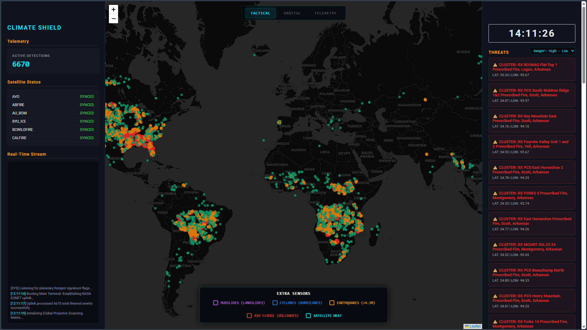

# Climate Shield

Climate Shield is a world-map dashboard for exploring wildfire reports and other environmental events.



**Try the live dashboard:** [climate-shield.netlify.app](https://climate-shield.netlify.app/)

## Quick start

Open the live dashboard link above. The frontend is hosted on Netlify and gets its data from the API on Hack Club Nest.

## What you can do

- Explore thousands of active NASA EONET wildfire reports on a world map. Marker size and colour show how many reports fall in the same approximate one-degree area.
- Switch on earthquake, volcano, storm, flood and raw satellite-heat layers.
- Select a fire to request local wind, terrain and air-quality readings. Click an open area to see a weather and soil-moisture scan.
- Open Orbital for a 3D globe, or use Telemetry for the event table, fire breakdown, CO2 history and satellite tracking.
- Launch Orbital Recon to view Esri satellite imagery centred on a selected location, with Windy radar, satellite, wind and temperature panels alongside it.

## How it works

The frontend is a static page on Netlify. A FastAPI backend on Hack Club Nest requests data from NASA EONET, USGS and Open-Meteo, so private API keys stay on the server. The fire feed is loaded in one request; detailed readings are only fetched when someone selects a location. Leaflet draws the map and its markers, and Globe.gl renders the 3D view.

The main map uses Esri World Street Map tiles. Recon uses Esri World Imagery. Those satellite images are the latest imagery Esri has for a place, not a live video feed; how recent they are varies by location. The Windy panels show their own available weather and satellite layers.

## Run it locally

You need Python 3 and two terminals.

1. Install the backend packages and start the API:

   ```bash
   cd climate-shield/backend
   pip install -r requirements.txt
   uvicorn main:app --reload
   ```

2. In another terminal, serve the frontend:

   ```bash
   cd climate-shield/frontend
   python3 -m http.server 8080
   ```

3. Open `http://localhost:8080`. Wind and ignition scans use Open-Meteo and do not need an API key. To use raw FIRMS satellite heat data, put `FIRMS_KEY=your_key` in `backend/.env`; do not commit that file.

Run the backend tests from `backend/` with `python -m unittest -v test_nasa.py`.

## A note on AI and the estimates

I used AI tools, including Gemini and GitHub Copilot, while building and repairing this project. They helped me understand NASA and USGS response formats, debug code, improve performance and work through some of the calculations. The live API routes have been tested, but the ignition, spread and water-use numbers are experimental estimates, not validated scientific forecasts. They should not be used for real emergency or firefighting decisions.

## Data and credits

Climate Shield uses NASA EONET and FIRMS, USGS, Open-Meteo, the Global Warming API for CO2 history, CelesTrak, Esri and Windy. Raw FIRMS data needs a `FIRMS_KEY` set on the backend. Esri's map tiles include their own provider attribution in the app.