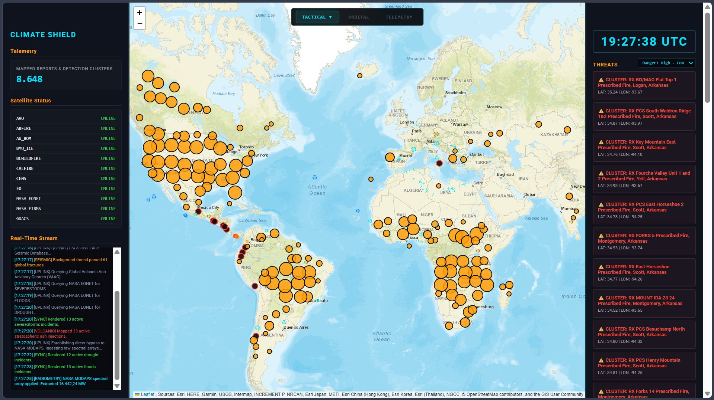

# Climate Shield

Climate Shield is a world-map dashboard for exploring wildfire reports and other environmental events.



**Try the live dashboard:** [climate-shield.netlify.app](https://climate-shield.netlify.app/)

## Quick start

Open the live dashboard link above. The frontend is hosted on Netlify and gets its data from the API on Hack Club Nest.

## What you can do

- Explore wildfire incident reports from NASA EONET and GDACS, with NASA FIRMS satellite heat detections shown as a separate kind of record. Recent, nearby reports can be linked as supporting observations; an unconfirmed heat detection is never silently labelled as a confirmed fire.
- Switch on earthquake, volcano, storm, flood and drought layers. Source labels stay with the reports, and overlapping alerts are merged only when their times and locations are close enough.
- Select an incident to request wind, terrain and air-quality readings. Its details stay open; the experimental wind-relative route is drawn only when requested. Click open land to see a weather and soil-moisture scan.
- Switch the Tactical basemap between street and satellite imagery. The default is the Esri street map; the choice is remembered in that browser.
- Open Orbital for a 3D globe, or use Telemetry for the event table, fire breakdown, CO2 history and satellite tracking.
- Launch Orbital Recon to view Esri satellite imagery centred on a selected location, with Windy radar, satellite, wind and temperature panels alongside it. The images are not live and can be different ages depending on location.

## How it works

The frontend is a static page on Netlify. A FastAPI backend on Hack Club Nest requests data from NASA EONET, NASA FIRMS, GDACS, USGS and Open-Meteo, so the optional FIRMS key stays on the server. Source feeds are fetched independently so an outage from one provider does not hide another provider's events.

EONET and GDACS wildfire reports are matched only when they are within about 5 km and 24 hours. Other reported-event layers use a 25 km, 24-hour match; USGS and GDACS earthquake reports use a separate 50 km, six-hour match. FIRMS pixels are linked to an incident only within about 750 metres and 24 hours. Otherwise the source remains a separate report or thermal-detection cluster. These rules reduce obvious duplicates, but cannot prove two reports describe the same real-world event.

At world zoom, the map groups nearby records into larger cells and renders individual records only as you zoom in. The 3D globe groups points into two-degree cells to keep the view lighter; the underlying event records remain available in Tactical and Telemetry. The main basemap uses Esri World Street Map tiles; Recon uses Esri World Imagery. The Windy panels show their own available weather and satellite layers.

## Run it locally

You need Python 3 and two terminals.

1. Install the backend packages and start the API:

   ```bash
   cd climate-shield/backend
   pip install -r requirements.txt
   uvicorn main:app --reload
   ```

2. In another terminal, serve the frontend:

   ```bash
   cd climate-shield/frontend
   python3 -m http.server 8080
   ```

3. Open `http://localhost:8080`. Wind and ignition scans use Open-Meteo and do not need an API key. To use raw FIRMS satellite heat data, put `FIRMS_KEY=your_key` in `backend/.env`; do not commit that file.

Run the backend tests from `backend/` with `python -m unittest -v test_nasa.py`.

## Hosting

Netlify publishes the frontend from GitHub. Hack Club Nest runs the API at `https://diego.hackclub.app` and forwards the domain to port `8000`. The backend needs to be updated separately from Netlify; on Nest, PM2 runs Uvicorn listening on `0.0.0.0:8000`. Keep `FIRMS_KEY` in the Nest `backend/.env` file and never commit it.

## A note on AI and the estimates

I used AI tools, including Gemini and GitHub Copilot, while building and repairing this project. They helped me understand NASA and USGS response formats, debug code, improve performance and work through some of the calculations. The live API routes have been tested, but the ignition, spread and water-use numbers are experimental estimates, not validated scientific forecasts. They should not be used for real emergency or firefighting decisions.

## Data and credits

Climate Shield uses NASA EONET and FIRMS, GDACS, USGS, Open-Meteo, the Global Warming API for CO2 history, CelesTrak, Esri and Windy. Wind, fire reports, GDACS alerts and the main map do not need API keys; raw FIRMS detections need a free NASA FIRMS key set on the backend. Esri's map tiles include their provider attribution in the app.